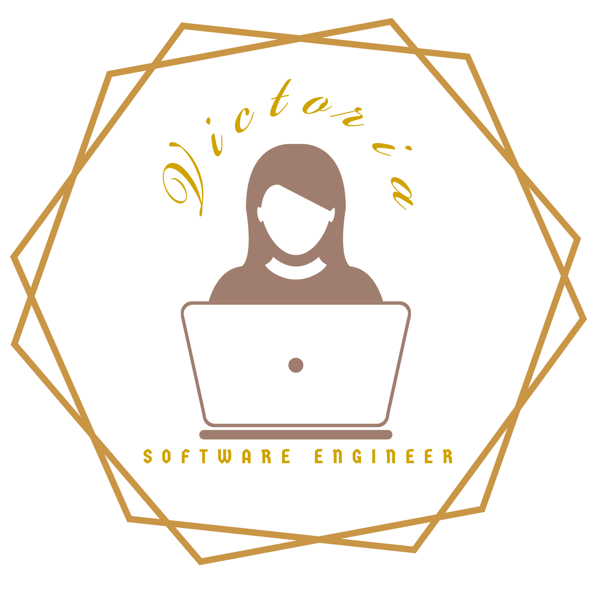

<div id="top"></div>

<!-- PROJECT LOGO -->
<br />
<div align="center">
  <a href="https://victoria-jeon.herokuapp.com/">
    
  </a>

<h3 align="center">Victoria's Website</h3>

  <p align="center">
    I used React and Bootstrap to create my portfolio website showcasing my projects.
    <br />
    <a href="https://github.com/facebook/create-react-app"><strong>Explore the docs »</strong></a>
    <br />
    <br />
    <a href="https://github.com/facebook/create-react-app#quick-overview">View Demo</a>
    ·
    <a href="https://github.com/hmj248/portfolio/issues/new">Report Bug</a>
    <!-- ·
    <a href="https://github.com/github_username/repo_name/issues">Request Feature</a> -->
  </p>
</div>

<!-- TABLE OF CONTENTS -->
<details>
  <summary>Table of Contents</summary>
  <ol>
    <li>
      <a href="#about-the-project">About The Project</a>
      <ul>
        <li><a href="#built-with">Built With</a></li>
      </ul>
    </li>
    <li>
      <a href="#getting-started">Getting Started</a>
      <ul>
        <li><a href="#prerequisites">Prerequisites</a></li>
        <li><a href="#installation">Installation</a></li>
      </ul>
    </li>
    <li><a href="#contributing">Contributing</a></li>
    <li><a href="#license">License</a></li>
    <li><a href="#contact">Contact</a></li>
  </ol>
</details>

<!-- ABOUT THE PROJECT -->

## About The Project
Web view:
Mobile view: 

<p align="right">(<a href="#top">back to top</a>)</p>

### Built With

- [React.js](https://reactjs.org/)
- [Bootstrap](https://getbootstrap.com)

<p align="right">(<a href="#top">back to top</a>)</p>

<!-- GETTING STARTED -->

## Getting Started

To get a local copy up and running follow these simple example steps.

### Prerequisites

You’ll need to have Node 14.0.0 or later version on your local development machine (but it’s not required on the server).

- npm
  ```sh
  npm install npm@latest -g
  ```

### Installation

1. npx
   ```sh
   npx create-react-app my-app
   cd my-app
   npm start
   ```
   npm start
2. Then open http://localhost:3000/ to see your app.

<p align="right">(<a href="#top">back to top</a>)</p>

## Contributing

Contributions are what make the open source community such an amazing place to learn, inspire, and create. Any contributions you make are **greatly appreciated**.

If you have a suggestion that would make this better, please fork the repo and create a pull request. You can also simply open an issue with the tag "enhancement".
Don't forget to give the project a star! Thanks again!

1. Fork the Project
2. Create your Feature Branch (`git checkout -b feature/AmazingFeature`)
3. Commit your Changes (`git commit -m 'Add some AmazingFeature'`)
4. Push to the Branch (`git push origin feature/AmazingFeature`)
5. Open a Pull Request

<p align="right">(<a href="#top">back to top</a>)</p>

<!-- LICENSE -->

## License

Distributed under the MIT License. See `LICENSE.txt` for more information.

<p align="right">(<a href="#top">back to top</a>)</p>

<!-- CONTACT -->

## Contact

Victoria Jeon - victoriahjeon@gmail.com

Project Link: https://victoria-jeon.herokuapp.com/

<p align="right">(<a href="#top">back to top</a>)</p>

<!-- ACKNOWLEDGMENTS -->


<p align="right">(<a href="#top">back to top</a>)</p>
